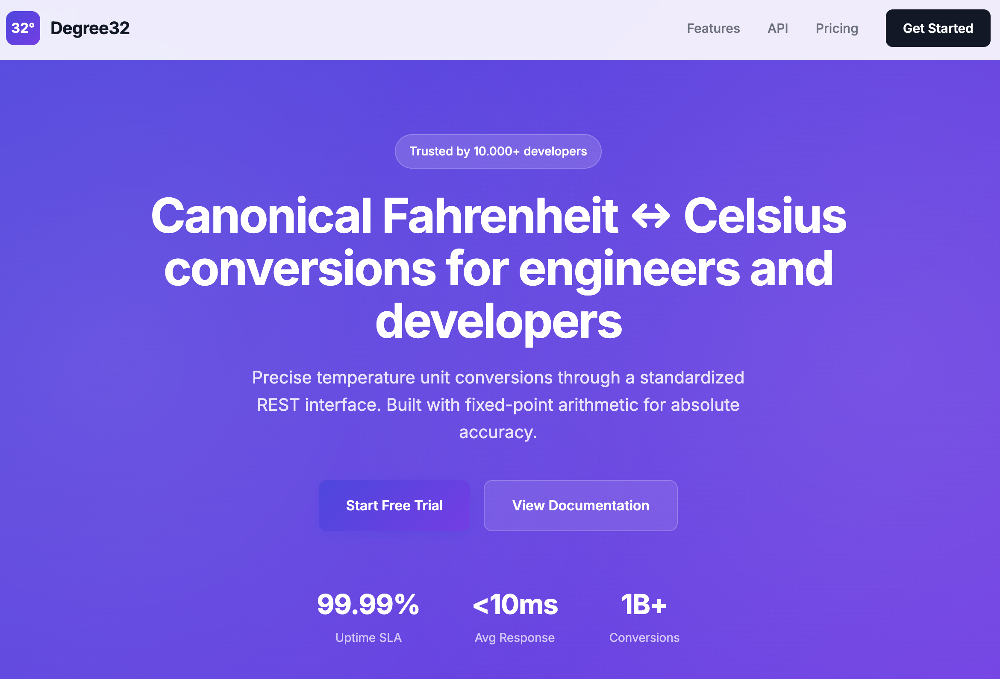

# Degree32



Enterprise-grade temperature conversion API service providing canonical Fahrenheit ↔ Celsius conversions for scientific, industrial, and software engineering applications. Degree32 delivers mathematically precise temperature unit conversions through a standardized REST interface, built with fixed-point arithmetic for absolute accuracy and compliance with international temperature standards.

## Overview

**Degree32** is a production-ready temperature conversion platform designed for applications requiring exactness, auditability, and standards compliance. The service implements fixed-point decimal arithmetic to eliminate floating-point errors entirely, ensuring every conversion is mathematically precise and reproducible. The name "Degree32" references 32°F, the canonical freezing point of water in the Fahrenheit scale (equivalent to 0°C in the Celsius scale), representing our commitment to precision and scientific accuracy.

## Project Structure

```
calc/
├── image-assets/       # Screenshots and images (e.g. homepage.png)
├── index.html          # Main landing page
├── about.html          # About page with company story
├── blog.html           # Blog listing page
├── careers.html        # Careers/jobs page
├── contact.html        # Contact page
├── documentation.html  # API documentation page
├── get-started.html    # Sign-up/get started page
├── privacy.html        # Privacy policy page
├── status.html         # API status page
├── terms.html          # Terms of service page
├── styles.css          # Comprehensive CSS stylesheet (2000+ lines)
└── README.md           # This file
```

## Features

### Design & User Interface

- **Professional UI/UX**: Enterprise-grade interface design with sophisticated gradient accents and smooth transitions
- **Responsive Architecture**: Fully responsive layout system that adapts seamlessly across mobile, tablet, and desktop viewports
- **Typography System**: Professional typeface selection using Google Fonts:
  - Inter (body text) - Optimized for readability and professional presentation
  - JetBrains Mono (code) - Monospace font designed for technical documentation
- **Visual Design**: Indigo/purple gradient color scheme maintaining professional standards while ensuring visual hierarchy
- **Component Architecture**: Comprehensive CSS component library including:
  - Fixed-position navigation header for persistent access
  - Hero sections with gradient backgrounds for visual impact
  - Interactive feature cards with hover state transitions
  - Pricing tier presentation with featured plan highlighting
  - Syntax-highlighted code blocks for API documentation
  - Form components with validation-ready input fields
  - Multi-column footer layouts with organized link structures
  - Documentation sidebar navigation for easy content discovery
  - Status dashboard components for system monitoring
  - Blog post card layouts with featured post capabilities
  - Team member profile cards
  - Job listing components with metadata display

### Page Structure

1. **Homepage (`index.html`)**
   - Hero section presenting core value proposition and service overview
   - Features section detailing key capabilities: "Exactness", "Auditability", "Determinism", and "Standards Compliance"
   - Interactive API examples with request/response code demonstrations
   - Pricing tier presentation (Individual, Professional, Enterprise)
   - Strategic call-to-action sections for user conversion

2. **About (`about.html`)**
   - Corporate narrative and organizational mission
   - Core organizational values and principles
   - Team member profiles and expertise
   - Corporate location and contact information

3. **Documentation (`documentation.html`)**
   - Comprehensive API reference documentation
   - Code examples in multiple programming languages
   - Software Development Kit (SDK) information and integration guides
   - Detailed endpoint documentation with parameter specifications

4. **Get Started (`get-started.html`)**
   - User registration and account creation interface
   - Authentication and authorization UI components

5. **Blog (`blog.html`)**
   - Technical blog post listings and archives
   - Featured post highlighting system
   - Category-based content organization with tagging system

6. **Careers (`careers.html`)**
   - Current job openings and position listings
   - Employee benefits and organizational perks
   - Application submission and recruitment information

7. **Contact (`contact.html`)**
   - Contact form for inquiries and support requests
   - Corporate contact information and office locations

8. **Status (`status.html`)**
   - Real-time API status dashboard
   - System health indicators and monitoring
   - Historical uptime metrics and performance analytics
   - Incident history and resolution tracking

9. **Legal Documentation**
   - Privacy policy (`privacy.html`) - Data protection and privacy compliance
   - Terms of service (`terms.html`) - Service agreement and usage terms

## Technical Specifications

### Technology Stack

The Degree32 frontend is built using modern web standards:

- **HTML5**: Semantic markup following W3C standards for accessibility and SEO
- **CSS3**: Advanced styling with:
  - CSS Custom Properties (CSS Variables) for maintainable theming
  - Flexbox and CSS Grid for responsive layouts
  - CSS transitions and transforms for enhanced user experience
  - Media queries for responsive design across device types
  - Backdrop filters for modern visual effects

### Browser Compatibility

The website is optimized for modern browsers with full support for:
- Chrome/Edge (latest stable versions)
- Firefox (latest stable version)
- Safari (latest stable version)

### External Dependencies

- **Google Fonts**: 
  - Inter (weights: 400, 500, 600, 700) - Primary typeface for body text
  - JetBrains Mono (weights: 400, 500) - Monospace font for code examples

### Deployment Architecture

The frontend is a pure static website implementation, requiring no JavaScript frameworks or build tooling. This architecture ensures:
- Fast load times and optimal performance
- Easy deployment to CDN and static hosting services
- Simplified maintenance and version control
- Reduced security surface area

## Getting Started

### Quick launch

To run the project locally:

1. **Clone the repo** (if you haven’t already):
   ```bash
   git clone <repository-url>
   cd calc
   ```

2. **Preview in a browser** (choose one):
   - **Fastest:** Open `index.html` in your browser (e.g. double-click it or drag it into a browser window).
   - **With a local server** (recommended for full navigation and correct paths):
     ```bash
     # Python 3
     python3 -m http.server 8000
     ```
     Then open [http://localhost:8000](http://localhost:8000) in your browser.
   - **With Node.js (npx):**
     ```bash
     npx -y serve
     ```
     Then open the URL shown in the terminal (e.g. http://localhost:3000).

No build step or install is required—the site is static HTML and CSS.

### Frontend Development

The Degree32 marketing website is a static HTML/CSS implementation designed for easy deployment and maintenance:

1. Clone this repository to your local development environment
2. Open `index.html` in a web browser for local preview (or use a local server as above)
3. Deploy to any static hosting service (no build process required)

### Architecture

The frontend implementation follows a modular architecture:

- **Shared Stylesheet**: All pages utilize a centralized CSS file (`styles.css`) for consistent styling and maintainability
- **Consistent Structure**: Standardized HTML structure across all pages:
  - Fixed header with navigation
  - Main content sections
  - Footer with links and legal information
- **Responsive Design**: Mobile-first approach with breakpoints for tablet and desktop viewports

### Customization

For organizations requiring custom branding or styling modifications:

1. **Color Scheme**: Modify CSS custom properties in `styles.css` (lines 7-26):
   ```css
   :root {
       --primary-500: #6366f1;
       --primary-600: #4f46e5;
       /* Additional color variables */
   }
   ```

2. **Typography**: Update the Google Fonts import in the `<head>` section of HTML files to match organizational branding guidelines

3. **Content Management**: Edit HTML files directly to update text, links, and structural elements as needed

## Design Philosophy

Degree32 is engineered to meet the rigorous requirements of scientific computing, industrial automation, and enterprise software systems. Our design philosophy emphasizes:

- **Mathematical Precision**: Fixed-point decimal arithmetic ensures zero floating-point errors, critical for scientific accuracy
- **Deterministic Results**: Identical inputs always yield identical outputs, essential for reproducible research and automated systems
- **Standards Compliance**: Adherence to international temperature definitions, including SI standards and ITS-90 scale
- **Enterprise Reliability**: API-key-based access with UUID tracking and comprehensive request/response logging for compliance and debugging
- **Developer Experience**: Intuitive REST API design with comprehensive documentation and multiple SDK options

The platform architecture prioritizes accuracy, reliability, and auditability to meet the demands of mission-critical applications.

## CSS Architecture

The `styles.css` file is organized into sections:

1. **Reset & Variables** (lines 1-26): Global reset and CSS custom properties
2. **Base Styles** (lines 28-43): Typography and container styles
3. **Header** (lines 45-124): Navigation and logo
4. **Buttons** (lines 126-190): Button component variants
5. **Hero Section** (lines 192-273): Landing page hero
6. **Sections** (lines 275-360): General section styling and features
7. **API Examples** (lines 362-426): Code block styling
8. **Pricing** (lines 428-540): Pricing tier cards
9. **CTA Section** (lines 542-574): Call-to-action sections
10. **Footer** (lines 576-662): Footer layouts
11. **Responsive** (lines 664-741): Mobile/tablet breakpoints
12. **Subpage Components** (lines 743-2007): Styles for documentation, contact, blog, about, careers, legal, and status pages

## Contributing

Degree32 welcomes contributions from the scientific and engineering community. We are committed to maintaining the highest standards of accuracy and reliability. Contributions should:

- Maintain mathematical precision and standards compliance
- Follow established coding standards and documentation practices
- Include appropriate testing for accuracy validation
- Adhere to our security and auditability requirements

Please review our contribution guidelines and code of conduct before submitting pull requests.

## License

Please refer to the LICENSE file in this repository for detailed licensing information. Degree32 is designed for use in scientific, industrial, and commercial applications requiring precise temperature conversions.

## Production Deployment

The frontend marketing website is a static HTML/CSS implementation that serves as the public-facing interface for the Degree32 service. The actual API backend is deployed separately and accessible through the documented REST endpoints. 

### Important Notes

- All navigation links are functional and lead to their respective documentation and service pages
- The frontend website provides comprehensive information about API capabilities, pricing, and documentation
- API endpoints are accessible through the production API gateway
- For API access, authentication, and technical support, please refer to the documentation or contact our support team

---

**Built with**: HTML5, CSS3, and enterprise-grade engineering standards.

